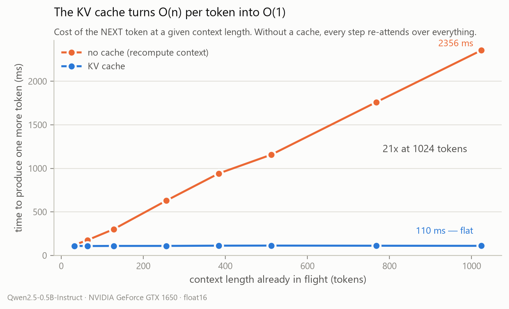
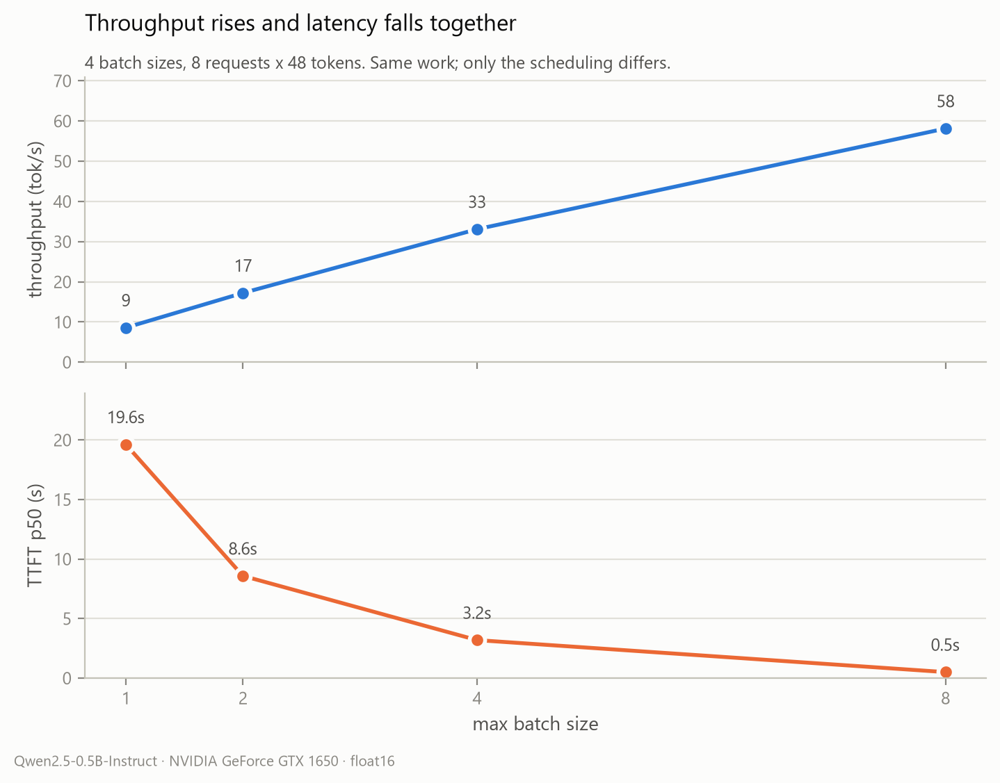
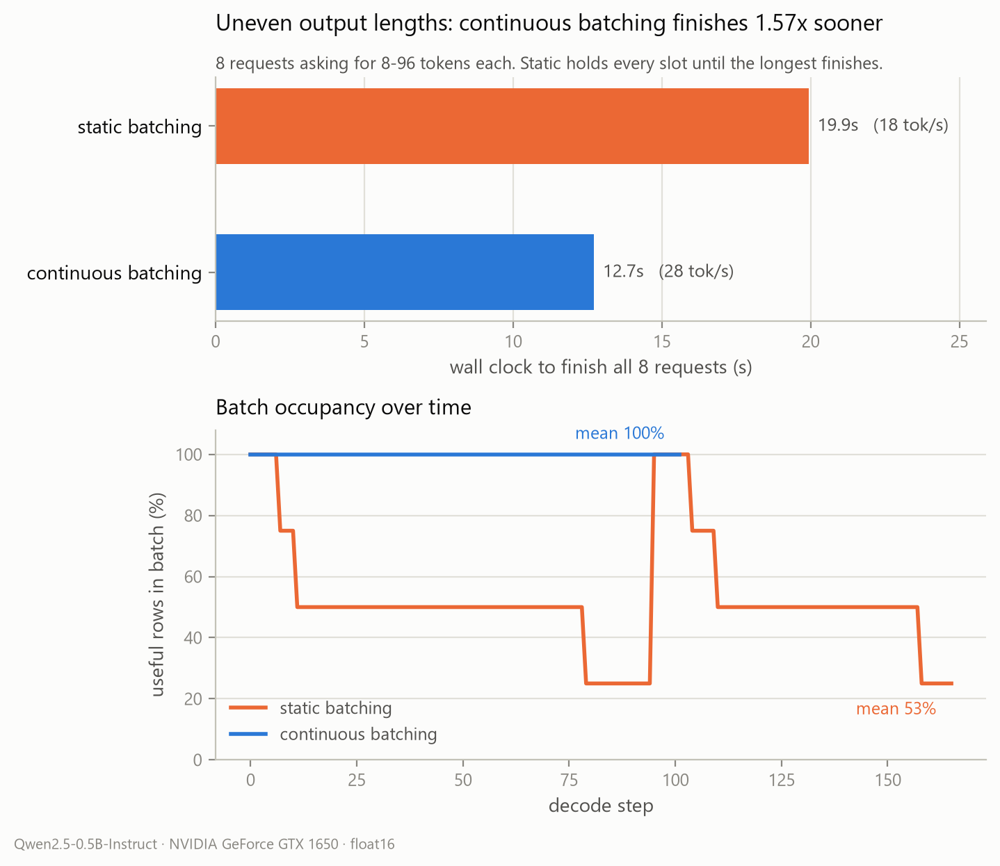
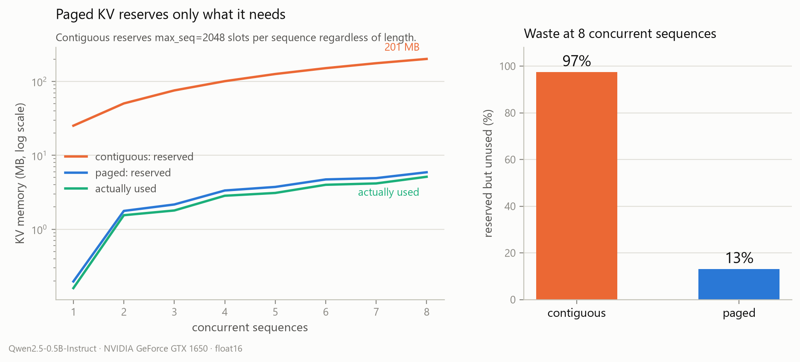

# tiny-infer

An LLM inference engine built from scratch in PyTorch — transformer, KV cache,
PagedAttention, and a continuous-batching scheduler — written to understand how
vLLM-class serving systems actually work.

Every layer is checked against the simpler thing it replaces. The hand-written
Qwen2 forward pass reproduces HuggingFace logits **exactly** (`max abs diff 0.0`),
paged attention is checked against cacheless recompute, and batched generation is
checked against generating each request alone.

```
M1  hand-written Qwen2, bit-exact vs HuggingFace
M3  KV cache + TTFT/ITL instrumentation
M4  PagedAttention: block-table allocator over a shared KV pool
M5  continuous batching: admit / decode / retire / preempt
M6  measurement harness + figures
```

---

## Results

Qwen2.5-0.5B-Instruct, GTX 1650 (4 GB), fp16. Regenerate with
`python scripts/collect_bench.py && python scripts/plot_bench.py`.

### 1. Why a KV cache exists



Cost of producing the *next* token at a given context length. Without a cache
every step re-attends over the whole context, so cost climbs linearly — **2356 ms
at 1024 tokens against a flat 110 ms, 21x**.

Measured as a function of context length rather than by timing a generation loop,
deliberately: below ~128 tokens this GPU is launch-bound and the attention term is
invisible. The loop version produces a flat step function that hides the entire
effect — and briefly shows *no cache* as the faster option.

### 2. Batching trades nothing away



Throughput rises and time-to-first-token falls *together*: **8.6 → 58 tok/s** while
**TTFT p50 drops 19.4 s → 0.5 s**.

Scaling is near-linear because decode here is launch-bound, not bandwidth-bound —
0.99 GB of weights at ~128 GB/s implies ~8 ms/token and we measure ~110 ms, so
there is a large fixed per-step cost for batching to amortize. On a GPU already
saturating memory bandwidth the same code would show a smaller multiple.

*Two panels, not one twin-axis chart: two y-scales on a single plot let the author
choose where the curves cross, which invents a relationship the data doesn't contain.*

### 3. Static vs continuous batching under uneven output lengths



The one that matters. Eight requests asking for 8–96 tokens each.

**Static batching** admits a wave and holds every slot until the *longest* member
finishes. Occupancy decays to 25% — the GPU keeps computing rows whose output is
thrown away, and queued work cannot start.

**Continuous batching** retires finishers the step they hit EOS and admits from the
queue into the hole, holding 100% occupancy.

**19.9 s → 12.7 s (1.57x)** on identical work. The speedup is bounded by the mean
occupancy gap (53% → 100%), which is why it widens as output lengths get more
variable — and real traffic is far more variable than this.

### 4. KV memory: contiguous vs paged



A contiguous per-sequence cache reserves `max_seq` slots regardless of what the
sequence does: **201 MB for 8 sequences that use 5 MB**. Paged allocation hands out
16-token blocks, so waste is bounded by block size instead of by the worst case —
**97% wasted → 13%**.

That 13% is the aggregate over these eight short sequences. Internal fragmentation
is per-sequence and at most `block_size - 1` slots, so the figure falls as
sequences get longer (a single 103-token sequence wastes 8%).

---

## How it works

### The model — [`tinyinfer/model.py`](tinyinfer/model.py)

A Qwen2 decoder written directly against the weights: RMSNorm in fp32,
rotary embeddings from a precomputed table, grouped-query attention (14 query
heads over 2 KV heads), SwiGLU MLP, tied input/output embeddings. The Qwen2
quirk that q/k/v carry biases while `o_proj` does not is handled in the layer
definition, and [`loader.py`](tinyinfer/loader.py) strips HF's `model.` prefix
so `load_state_dict` stays strict about everything else.

`forward` returns only the last position by default. Generation never samples
from anywhere else, and projecting all *s* positions through a 151936-wide
`lm_head` costs 12.9 ms per position on this GPU. The Milestone 1 oracle passes
`return_all_logits=True` because a teacher-forced comparison needs every position.

### Paged KV cache — [`block_manager.py`](tinyinfer/block_manager.py) + `PagedKVCache`

The allocator is an OS page table. A flat pool of `num_blocks * block_size` token
slots is shared by every sequence; each sequence gets a `block_table` mapping
logical block index → physical block id. Sequences need contiguity only in the
*table*, never in memory.

```python
def slot(self, seq_id, logical_pos):
    block = self.block_tables[seq_id][logical_pos // self.block_size]
    return block * self.block_size + (logical_pos % self.block_size)
```

The pool keeps its slot dimension flat — `(layers, num_blocks * block_size,
kv_heads, head_dim)` — so a write is one `index_copy_` and a read is one
`index_select` on dim 0, with no reshape arithmetic in the hot path.

### Continuous batching — [`tinyinfer/engine.py`](tinyinfer/engine.py)

One `step()` is admit → retire → decode → retire:

- **Admit** — prefill waiting requests into free capacity, head of queue first.
  Head-of-line blocking is deliberate; reordering would starve large requests.
- **Decode** — one batched forward over every running sequence, one token each.
- **Retire** — anything hitting EOS or its token cap frees its blocks and leaves
  the batch that same step.
- **Preempt** — when the pool runs dry, evict the *newest* running request, free
  its blocks, and push it to the **front** of the queue. Newest-first has the least
  accumulated work to redo and protects older requests' latency; front-of-queue
  means eviction can't starve its own victim. The victim replays
  `prompt + tokens already emitted`, so eviction costs time but never loses progress.

---

## Three things that are easy to get wrong

**Per-sequence RoPE positions.** Rows of a decode batch sit at different absolute
positions — one sequence at token 45, another at 78. A single
`cos_cache[start_pos : start_pos + s]` slice rotates every sequence to the same
position. It is silently wrong and completely invisible at batch size 1, which is
exactly why `Qwen2Model.forward` takes a `(b, s)` `positions` tensor.

**Cumulative capacity checks.** Four sequences each needing one fresh block need
four blocks *collectively*. A per-sequence `can_allocate` happily approves the
batch with three free, then fails mid-loop with some sequences already advanced.
`_blocks_for_one_more()` sums the requirement across the batch before allocating
anything.

**Causal masking has three cases, not two.** Prefill is causal (`q_len == kv_len`).
Single-sequence decode is not (one query legitimately attends to every cached key).
Ragged batched decode is neither — `q_len == 1` so nothing is causal, but the
shorter sequences' padding *must* be masked or they attend to whatever tenant last
held those slots.

---

## Testing

Every test is **differential**: each milestone is checked against the simpler
implementation it replaces, not against a golden file that would freeze in a bug.

| test | what it proves |
|---|---|
| [`test_milestone1.py`](test_milestone1.py) | hand-written Qwen2 == HuggingFace, `max abs diff 0.0` |
| [`test_paged.py`](test_paged.py) | paged decode == cacheless recompute |
| [`test_engine.py`](test_engine.py) | batched generation == generating each request alone |
| [`test_blocks.py`](test_blocks.py) | block allocator traced by hand on a tiny pool |

The tests are written to be *hard to pass accidentally*:

- `test_paged.py` **fragments the pool first**, holding a decoy sequence so the
  real one cannot land on a contiguous run of blocks (it lands on `[60, 59]`,
  descending). A bug that assumes contiguity survives a clean pool and dies here.
- `test_engine.py` uses **deliberately uneven prompts** (5/19/5/5 tokens) so the
  batch is ragged and padding is exercised; equal-length prompts would pass with
  the mask logic entirely broken. It then repeats the run with the pool sized
  **below** peak demand to force a real eviction, and requires the evicted request
  to produce identical tokens after recompute.
- It compares **token ids, not decoded text**, and asserts the block pool is fully
  reclaimed at the end so a leak can't hide.

`test_engine.py` runs fp32 by default. In fp16 the batched kernels reduce in a
different order, so a near-tied argmax can legitimately flip — one request diverged
at token 7 (`' objects'` → `' matter'`) and matched exactly in fp32. Run
`python test_engine.py --fp16` to see it. That's precision, not a scheduling bug,
and the assertion was left strict rather than loosened to hide it.

---

## Quickstart

```bash
python -m venv venv
venv/Scripts/activate            # source venv/bin/activate on POSIX
pip install -r requirements.txt
pip install -e . --no-deps       # puts `tinyinfer` on the path from any cwd
```

`--no-deps` matters: torch here is `2.12.1+cu126` from the CUDA wheel index, and
letting pip resolve a bare `torch` can swap in the CPU build from PyPI.

Weights are **not** in this repo (942 MB, over GitHub's 100 MB file limit). Config
and tokenizer are vendored under [`reference/`](reference/) for offline inspection;
the weights come from the Hub at a pinned revision:

```bash
huggingface-cli download Qwen/Qwen2.5-0.5B-Instruct \
  --revision 7ae557604adf67be50417f59c2c2f167def9a775
```

> **Note:** the scripts currently resolve the snapshot by globbing a hardcoded
> `F:\hf_cache\...` path (`MODEL_PATH` at the top of each entry point). Point it at
> your own cache before running.

```bash
python test_milestone1.py                    # bit-exactness vs HuggingFace
python test_paged.py                         # paged KV correctness
python test_engine.py                        # continuous batching correctness
python scripts/generate.py "Explain KV caching:"
python scripts/bench_batching.py             # continuous vs sequential
python scripts/collect_bench.py              # all measurements -> bench_data.json
python scripts/plot_bench.py                 # bench_data.json -> docs/*.png
```

---

## Layout

| path | |
|---|---|
| [`tinyinfer/config.py`](tinyinfer/config.py) | reads HF `config.json` |
| [`tinyinfer/model.py`](tinyinfer/model.py) | Qwen2 forward pass + `PagedKVCache` |
| [`tinyinfer/loader.py`](tinyinfer/loader.py) | safetensors → module tree |
| [`tinyinfer/block_manager.py`](tinyinfer/block_manager.py) | logical position → physical slot |
| [`tinyinfer/engine.py`](tinyinfer/engine.py) | continuous batching scheduler |
| [`tinyinfer/sampler.py`](tinyinfer/sampler.py) | greedy / temperature / nucleus |
| [`scripts/generate.py`](scripts/generate.py) | single-stream generation, TTFT + ITL |
| [`scripts/collect_bench.py`](scripts/collect_bench.py) | all measurements → JSON |
| [`scripts/plot_bench.py`](scripts/plot_bench.py) | JSON → the four figures |

---

## Known costs and limitations

Kept here on purpose — the unflattering numbers are the ones that make the rest
trustworthy.

- **Paging costs ~23% ITL** (160 ms vs 130 ms median). The contiguous cache
  returned a *view*; `gather()` materializes the sequence's K/V per layer per
  token. Real PagedAttention never pays this — the block table goes *into* a
  custom attention kernel that walks blocks during the QK product. Stock SDPA
  cannot express that, so this is the honest cost of doing it in PyTorch.
- **`enable_gqa=True` costs ~17% on this GPU.** On sm_75 with this Windows torch
  build, every fused SDPA backend is unavailable (flash isn't compiled in,
  mem-efficient is runtime-disabled), so it falls to the MATH backend whose
  internal broadcast is slower than materializing k/v with `repeat_interleave`.
  It's the right code for sm_80+ and the wrong code here.
- **Decode is ~14x off the memory roofline** — launch-bound at batch 1 on 14 SMs
  under WDDM, not bandwidth-bound. CUDA graphs are the lever.
- **`batched_read_slots` rebuilds every sequence's full slot list in Python each
  step** — O(batch × seqlen) host work per token. Fine at ~100 tokens, a problem
  at 2k.
- Single GPU, single node, greedy decoding in the engine path. No chunked prefill,
  no prefix caching, no speculative decoding, no tensor parallelism, no quantization.

---

## References

- [Efficient Memory Management for LLM Serving with PagedAttention](https://arxiv.org/abs/2309.06180) (vLLM)
- [Orca: A Distributed Serving System for Transformer-Based Generative Models](https://www.usenix.org/conference/osdi22/presentation/yu) (continuous batching)
- [Qwen2 Technical Report](https://arxiv.org/abs/2407.10671)
- [RoFormer: Enhanced Transformer with Rotary Position Embedding](https://arxiv.org/abs/2104.09864)
